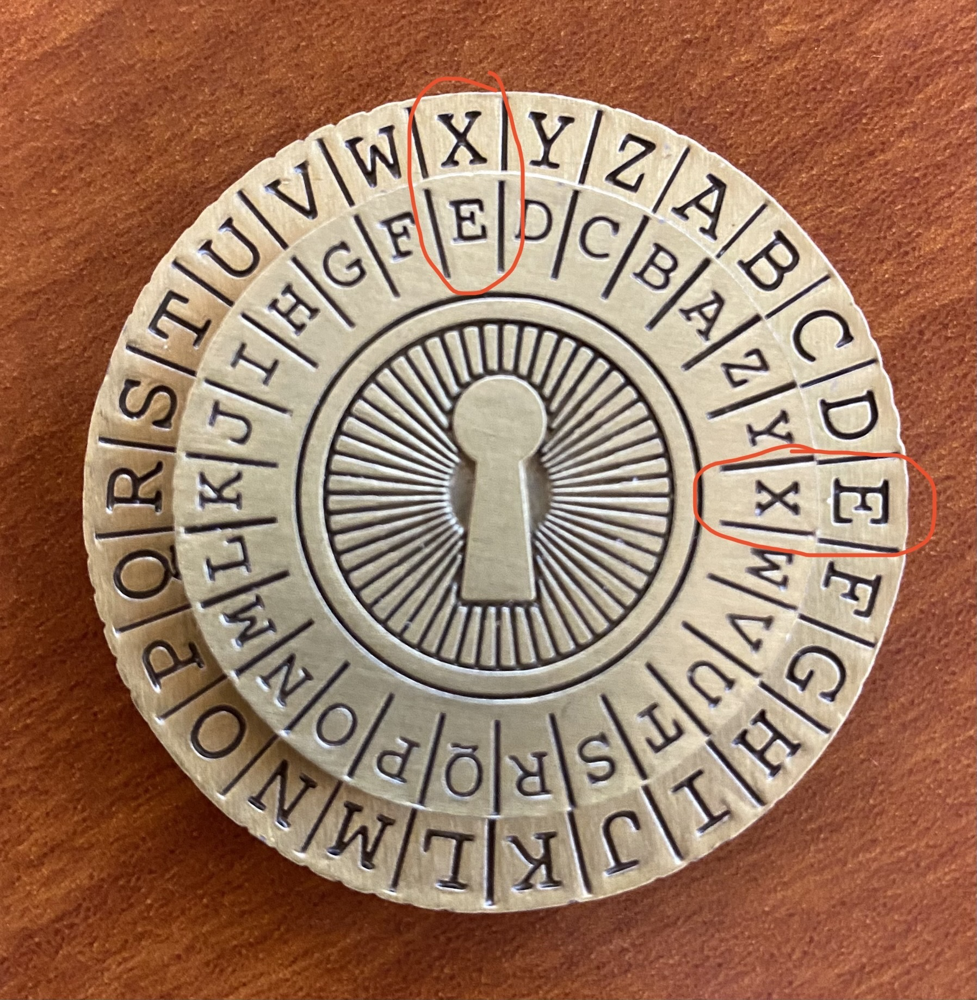

# Technical 1 - Mobile Frontend Developer
Congratulations! You have progressed to our technical #1 challenge. In this challenge, your task is to code-ify the decoder ring shown below. The decoder ring is a tool that allows you to decode secret encoded messages. In order to read a secret message, you will need two things: **a cipher** and an **encoded message**.

## How to use the decoder:
1. Place the inner ring inside of the outer ring
2. For each encoded message, there will be a cipher. The cipher will consist of two letters that need to be lined up. In the image below, we used the cipher E = X. You can see that both instances of E and X in the inner and outer ring line up. This will be the case for any letter pairing you choose for the cipher.
3. There will also be an encoded message. In order to decode the message, you must replace each letter from the encoded message with new letters found on the decoder ring. For example (still using the image below), if the encoded message was ZNYX, the decoded message would be CODE (Z → C, N → O, Y → D, X → E).

## Decoder
<p style="text-align: center">
  
</p>

## Your task
Your task is to write a javascript function that accepts 3 parameters: **cipher_letter_1**, **cipher_letter_2**, and **encoded_message**. In the example given above, cipher_letter_1 = E, cipher_letter_2 = X, and encoded_message = ZNYX. The function should then return a **decoded_message** based on the ruleset described above. In the example given above, the returned decoded_message would be "CODE". Once you have built your code-ified decoder ring, you will use it to help discover the next steps in our hiring process. Here is a piece of code you can copy to get you started:

```javascript
function decodeMessage(cipherLetterOne, cipherLetterTwo, encodedMessage) {
  let decodedMessage = "";
  // Your code goes here
  
  return decodedMessage;
}
```

## A few things to note:
1. Note that the outer ring has the letters from A to Z going clockwise. The inner ring has the letters from A to Z going counterclockwise.
2. Some of our encoded messages will include characters besides letters. In your solution, only letters should be modified. Leave any punctuation, numbers, etc. how they are.
3. In the encoded messages, there will be both capital and lowercase letters. In a successful solution, capital letters will map to capital letters, and lowercase letters will map to lowercase letters (Example using ring above: S → J, s → j).
4. Try to account for any edge cases that there might be. We will be testing your code to make sure it works in all cases.

## Next Steps
If at any point you get stuck, have any questions, or wish to submit an unfinished solution, please email careers@linxsystems.com and make the subject line “Frontend Tech #1 Help”. If this is the case, send us your code by creating a secret gist (https://gist.github.com) and send us the link. We also encourage you to explain your thought process throughout this exercise.

We encourage you to test your code, referencing the image above to see if your code is working or not. Once you believe you have a working solution, you can put it to the test with the encoded messages below. Copy and paste these encoded messages and plug them into your function. Then follow the instructions to discover your next steps in the hiring process:

#### Message #1
- Cipher: B = E
- Encoded Message: Hrl dfs cbdrcb myb nbdrsc tbnnfzb eh tfmdyxsz lq myb ubmmbon f fsc m aro myb dxqybo.

#### Message #2
- Cipher: ?
- Encoded Message: Nf af amp kfs ilbalgn vfz tcp teeivlgn ofc fg fzc xpsblap (maaeb://ilgwbvbaphb.rfh/rtcppcb/5). Fgrp vfz tcp fg amp kfs ilbalgn etnp, rilrj tgvxmpcp fg amp etnp tgq avep lg "lxtgatkfs".

