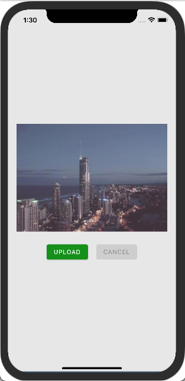
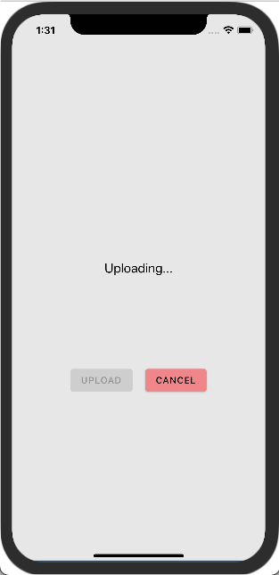

# Technical 1
### Mobile Frontend
If you are applying for a frontend mobile developer position, please complete this section.

## Instructions

For this assessment, we would like for you to complete the following edits to a simple upload UI like the one pictured below.

    
    

The base code can be found at this link: https://snack.expo.dev/@linxsystems/tech-1---simple-image-upload-ui

- [ ] **Req 1**: Keep track of the "uploading" or "not uploading" status of the app.
- [ ] **Req 2**: If "uploading", display a basic indicator (text like "Uploading..." will do) and disable the Upload button. The indicator should be centered in a view of given image size.
- [ ] **Req 3**: If "not uploading", display an image with given image source and disable the cancel button. 
- [ ] **Req 4**: Add in onPress functionality to the buttons to toggle the "uploading"/"not uploading" status.
- [ ] **Req 5**: Display the Upload and Cancel buttons along the same row (instead of column).

Create an https://expo.dev/ account and save the base code to your account. Email the expo link of your solution to careers@linxsystems.com

**Do not post your answer here.**
